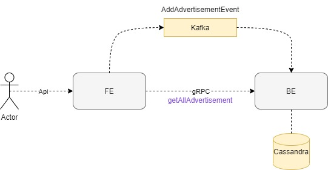

# pontsystems-homework

# helm  

kubectl create namespace env
  
helm repo add bitnami https://charts.bitnami.com/bitnami  
helm install cassandra --namespace env --set dbUser.password=cassandra,cluster.datacenter=datacenter1 bitnami/cassandra

helm install kaffka --namespace env bitnami/kafka

# Kafka/cassandra indítása local-ban  
cd env/local
docker-compose up

# Cassandra hasznos parancsok  
docker-compose exec cassandra bash  
cqlsh -u cassandra -p cassandra  

create keyspace advertisement WITH replication = {'class':'SimpleStrategy', 'replication_factor' : 1};  

describe advertisement  

select * from advertisement.advertisemententity;
